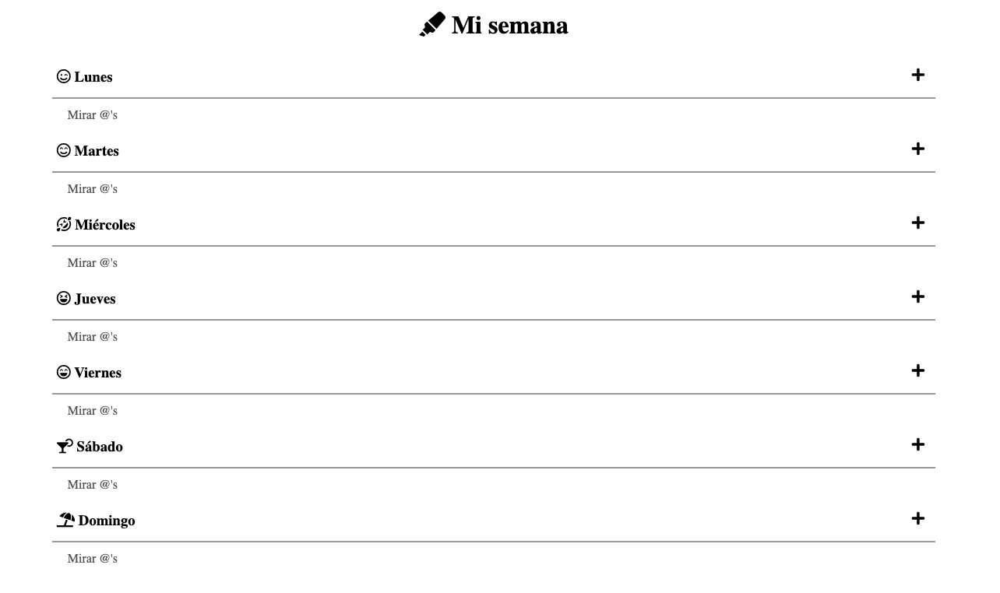

# mi-semana-todo-list
Aplicación web para llevar un control de tareas de la semana.

## Instalación
Se trata de una web portable, por lo que no necesita conexión a servidor. Los datos se guardan en el navegador web, por lo que su instalación es muy sencilla:

1.- Descárgatela (arriba, en el botón verde).

2.- Descomprime el fichero bajado.

3.- Mueve la carpeta generada donde quieras.

4.- Abre el fichero index.html con tu navegador preferido.

